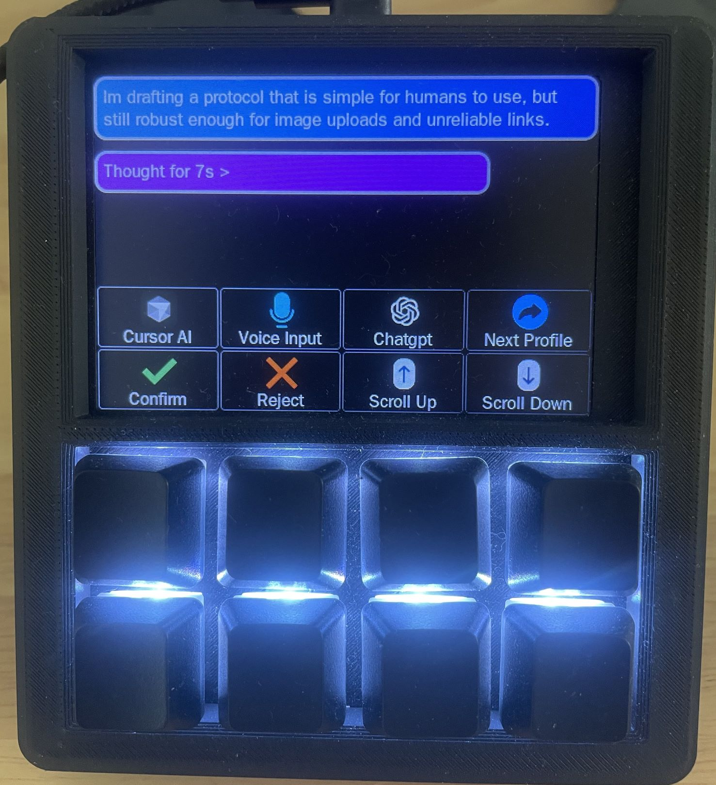

To allow the Macropad’s LCD to display customized content such as dynamic feedback from AI tools, we designed a communication protocol for interacting with the Macropad. This protocol enables any third-party application to easily send messages to the Macropad for display.

For detailed information about this protocol, please refer to [Customised Display Protocol Between Host And Macro Pad](protocol/host_usb_cdc_customised.md)

This is an application example for interacting with AI tools.

