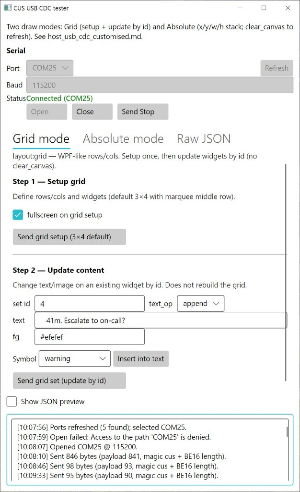

To make debugging easier, I wrote a test program for sending protocol text to the Macropad.



## Download (Windows)

Pre-built **self-contained** Windows x64 build — no .NET install required:

- [CusProtocolTester-win-x64-net8.0.zip](prebuild-bin-file/CusProtocolTester-win-x64-net8.0.zip)

1. Download the zip, extract it, and run `CusProtocolTester.exe`.
2. Select the device COM port, click **Open**, then use **Grid mode** / **Absolute mode** / **Raw JSON**.

Protocol details: [host_usb_cdc_customised.md](../protocol/host_usb_cdc_customised.md)

## Build from source

Requires [.NET 8 SDK](https://dotnet.microsoft.com/download/dotnet/8.0).

```bash
dotnet run -c Release
```

Or open `CusProtocolTester.sln` in Visual Studio 2022 and press F5.
